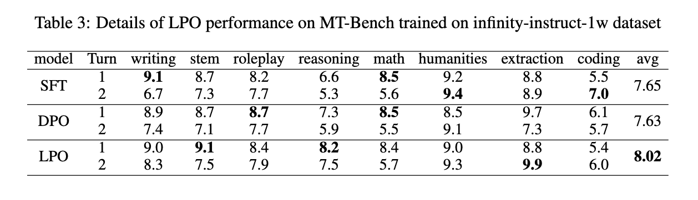

<div align="center">
    <h1>
    LPO
    </h1>
    <p>
    <b><em>LINEAR PREFERENCE OPTIMIZATION: DECOUPLED GRADIENT CONTROL VIA ABSOLUTE REGULARIZATION</em></b>
   </p>
    <p>
    </p>
    </p>
    <a href="https" style="color:red">Paper</a> |  
    <a href="https://huggingface.co/IDEA-Emdoor/UniTTS-mixed-v0.1" style="color:#FFD700">Hugging Face Model</a>  |
    <a href="https://github.com/IDEA-Emdoor-Lab/LPO" style="color:gray">Code</a>
     <p>
        
    </p>
     <p>
        
        
    </p>
</div>


## Overview

we propose Linear Preference Optimization (LPO), a novel alignment framework featuring three key innovations. First, we introduce gradient decoupling by replacing the log-sigmoid function with an absolute difference loss, thereby isolating the optimization dynamics. Second, we improve stability through an offset constraint combined with a positive regularization term to preserve the chosen response quality. Third, we implement controllable rejection suppression using gradient separation with straightforward estimation and a tunable coefficient that linearly regulates the descent of the rejection probability. Through extensive experiments, we demonstrate that LPO consistently improves performance on various tasks, including general text tasks, math tasks, and text-to-speech (TTS) tasks. These results establish LPO as a robust and tunable paradigm for preference alignment, and we release the source code, models, and training data publicly.


## Available models
We conducted comprehensive experiments across general text tasks, mathematics-specific domains, and text-to-speech (TTS) systems. The results demonstrate consistent improvements across all models. Below are the corresponding trained open-source models for each scenario.
|Model Version| Huggingface |  Application |
|-----------------------|---------|-----------------------------------|
| General Text Task | [HuggingFace](https://huggingface.co/IDEA-Emdoor/Qwen2.5-7B-ExtVocab) | For Pretrain |
| Math Model   | [HuggingFace](https://huggingface.co/IDEA-Emdoor/UniTTS-mixed-v0.1)   | Chinese TTS infernce/text dialogue/long-cot |
| TTS Model   | [HuggingFace](https://huggingface.co/IDEA-Emdoor/UniTTS-mixed-v0.1)   | Chinese TTS infernce/text dialogue/long-cot |

## Install
**Clone and Install**

- Clone the repo
``` sh
git clone git@github.com:IDEA-Emdoor-Lab/LPO.git
cd LPO
```

- Installation environment
``` sh
conda create -n lpo -y python=3.10
conda activate lpo
pip install -r requirements.txt
```


## Training Usage

We have open-sourced our data construction pipeline and training code, detailed below:

Step 1: Data Pipeline
The data construction process consists of three components: Candidate generation，logit computation for the data， onversion to mmap-format training data
``` sh
cd ./toolkits/lpo_data_preprocessing
sbatch scripts/gene_lpo_lam_cand.sh
```

Step 2: Model Training

``` sh
cd ./examples/qwen2_5
sbatch run_mcore_qwen_xpo.sh
```


## Evaluation
To validate the effectiveness of the algorithm, comprehensive experiments were conducted in three domains: general text tasks, domain-specific mathematical text tasks, and TTS speech generation tasks.
### RESULTS ON GENERAL TASKS

During the alignment phase, we validated the algorithm's robustness using both noisy training data and high-quality preference training data.

1) Infinity-Preference: An open-source, high-quality preference dataset characterized by subtle distinctions between chosen and rejected responses, minimal noise, and greater learning difficulty.

2) Infinity-instruct-1w: We randomly selected 10,000 samples from the remaining Infinity-instruct data. The responses of the original Infinity-instruct dataset serve as the chosen set, while data generated by Qwen2.5-SFT (under temperature=1.0, top\_p=1.0) serves as the rejected set. This constructed training dataset is of lower quality than Infinity-Preference.





### RESULTS ON MATH TASKS
LPO achieves a score of 88.86 on the GSM8K benchmark, representing a 4.71-point improvement over the SFT model and surpassing the performance of Qwen2.5-Instruct. In contrast, DPO exhibits a 1.81-point degradation compared to the SFT baseline. As noted in DPOP, DPO often fails to achieve strong results on mathematical reasoning tasks. 


### RESULTS ON TEXT-TO-SPEECH TASKS
The LPO algorithm demonstrates significant improvements in emotional expressiveness and fidelity compared to the SFT model, while exhibiting a slight decrease in stability. This outcome validates the effectiveness of the LPO algorithm in the field of speech generation.


## References


## Citation
```
@misc{wang2025unittsendtoendttsdecoupling,
      title={UniTTS: An end-to-end TTS system without decoupling of acoustic and semantic information}, 
      author={Rui Wang and Qianguo Sun and Tianrong Chen and Zhiyun Zeng and Junlong Wu and Jiaxing Zhang},
      year={2025},
      eprint={2505.17426},
      archivePrefix={arXiv},
      primaryClass={cs.SD},
      url={https://arxiv.org/abs/2505.17426}, 
}
```


## Disclaimer

Our model provides zero-shot voice cloning only for academic research purposes. We encourage the community to uphold safety and ethical principles in AI research and applications.

Important Notes:

- Compliance with the model's open-source license is mandatory.

- Unauthorized voice replication applications are strictly prohibited.

- Developers bear no responsibility for any misuse of this model.


## License
<a href="https://arxiv.org/abs/2505.17426">UniTTS: An end-to-end TTS system without decoupling of acoustic and semantic information</a> © 2025 by <a href="https://creativecommons.org">Rui Wang, Qianguo Sun, Tianrong Chen, Zhiyun Zeng, Junlong Wu, Jiaxing Zhang</a> is licensed under <a href="https://creativecommons.org/licenses/by-nc-nd/4.0/">CC BY-NC-ND 4.0</a>
